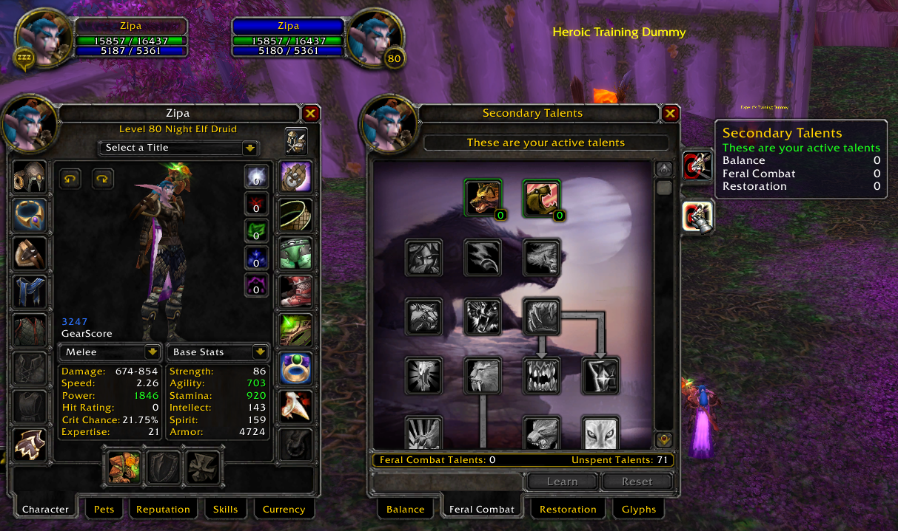

# Druid Feral Combat

# Disclaimer
Tests were heavily based on DrDamage addon info  
DrDamage Version: [1.7.8](https://www.wowace.com/projects/dr-damage/files/426084)  

Values that have small variations comparing with DrDamage (1-4 diff) are disregard. For example "you hit for 1000" but DrDamage states 1002

Damage attacks/spells were performed agaisnt a lvl60 dummy

# Setup
flat **1846 Attack Power** (no armor penetration, talents, buffs, item procs, item tier bonus, glyphs, etc)  

## Spells
Spell | status | note
----- | ------ | ----
Aquatic Form            | &nbsp; :heavy_check_mark:
Dash                    | &nbsp; :heavy_check_mark:
Bash                    | &nbsp; :heavy_check_mark:
Demoralizing Roar       | &nbsp; :heavy_check_mark:
Cat Form                | &nbsp; :heavy_check_mark:
Dire Bear Form          | &nbsp; :heavy_check_mark:
Challenging Roar        | &nbsp; :heavy_minus_sign:
Enrage                  | &nbsp; :heavy_check_mark:
Claw                    | &nbsp; :heavy_check_mark:
Faerie Fire (Feral)     | &nbsp; :heavy_check_mark:
Cower                   | &nbsp; :heavy_minus_sign:
Feline Grace            | &nbsp; :heavy_check_mark:
Ferocius Bite           | &nbsp; :heavy_check_mark:
Pounce                  | &nbsp; :heavy_check_mark:
Frenzied Regeneration   | &nbsp; :heavy_check_mark:
Prowl                   | &nbsp; :heavy_check_mark:
Growl                   | &nbsp; :heavy_minus_sign:
Rake                    | &nbsp; :heavy_check_mark: | [It seems the hit damage is a bit low although](./img/spell_rake.png) (42 diff). [At Higher Attack Power](./img/spell_rake2.png) (60 diff). Maybe DrDamage not displaying correctly
Lacerate                | &nbsp; :heavy_check_mark:
Ravage                  | &nbsp; :heavy_check_mark:
Maim                    | &nbsp; :heavy_check_mark:
Rip                     | &nbsp; :heavy_check_mark:
Maul                    | &nbsp; :heavy_check_mark:
Savage Defense          | &nbsp; :heavy_check_mark:
Savage Roar             | &nbsp; :heavy_check_mark:
Track Humanoids         | &nbsp; :heavy_check_mark:
Shred                   | &nbsp; :heavy_check_mark:
Travel Form             | &nbsp; :heavy_check_mark:
Swift Flight Form       | &nbsp; :heavy_check_mark:
Swipe (Bear)            | &nbsp; :heavy_check_mark:
Swipe (Cat)             | &nbsp; :heavy_check_mark:
Tiger's Fury            | &nbsp; :heavy_check_mark:

# Talents
Talent | status | note
------ | ------ | ----
Ferocity                        | &nbsp; :heavy_check_mark:
Feral Aggression                | &nbsp; :heavy_check_mark: | [Doesn't update the buff tooltip](./img/spell_demo-roar.png)
Feral Instinct                  | &nbsp; :heavy_check_mark:
Savage Fury                     | &nbsp; :heavy_check_mark:
Thick Hide                      | &nbsp; :heavy_check_mark:
Feral Swiftness                 | &nbsp; :heavy_check_mark:
Survival Instincts              | &nbsp; :heavy_check_mark:
Sharpened Claws                 | &nbsp; :heavy_check_mark:
Shredding Attacks               | &nbsp; :heavy_check_mark:
Predatory Strikes               | &nbsp; :heavy_check_mark:
Primal Fury                     | &nbsp; :heavy_check_mark:
Primal Precision                | &nbsp; :heavy_check_mark:
Brutal Impact                   | &nbsp; :heavy_check_mark:
Feral Charge                    | &nbsp; :heavy_check_mark:
Nurturing Instinct              | &nbsp; :heavy_check_mark:
Natural Reaction                | &nbsp; :heavy_check_mark:
Heart of the Wild               | &nbsp; :heavy_check_mark:
Leader of the Pack              | &nbsp; :heavy_check_mark:
Improved Leader of the Pack     | &nbsp; :heavy_check_mark:
Primal Tenacity                 | &nbsp; :heavy_check_mark:
Protector of the Pack           | &nbsp; :heavy_check_mark:
Predatory Instincts             | &nbsp; :heavy_check_mark:
Infected Wounds                 | &nbsp; :heavy_check_mark:
King of the Jungle              | &nbsp; :heavy_check_mark:
Mangle                          | &nbsp; :heavy_check_mark:
Improved Mangle                 | &nbsp; :heavy_check_mark:
Rend and Tear                   | &nbsp; :heavy_check_mark:
Primal Gore                     | &nbsp; :heavy_check_mark:
Berserk                         | &nbsp; :heavy_check_mark: