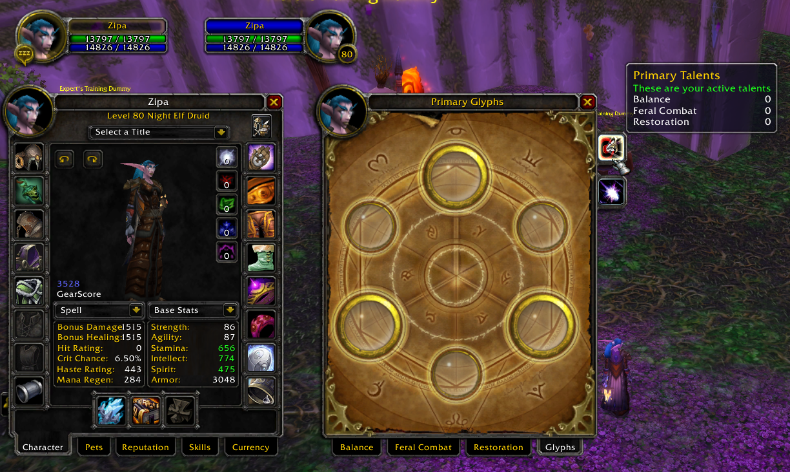

# Druid Restoration

# Disclaimer
Tests were heavily based on DrDamage addon info  
DrDamage Version: [1.7.8](https://www.wowace.com/projects/dr-damage/files/426084) 

Values that have small variations comparing with DrDamage (1-4 diff) are disregard. For example "you hit for 1000" but DrDamage states 1002

Damage attacks/spells were performed agaisnt a lvl60 dummy

# Setup
flat **1515 spellpower** (no talents, buffs, item procs, item tier bonus, glyphs, etc)

## Spells
Spell | status | note
----- | ------ | ----
Abolish Poison  | &nbsp; :heavy_check_mark:
Rebirth         | &nbsp; :heavy_check_mark:
GotW            | &nbsp; :heavy_check_mark:
Regrowth        | &nbsp; :heavy_check_mark:
Healing Touch   | &nbsp; :heavy_check_mark:
Rejuvenation    | &nbsp; :heavy_check_mark:
Lifebloom       | &nbsp; :heavy_check_mark:
Remove Curse    | &nbsp; :heavy_check_mark:
MotW            | &nbsp; :heavy_check_mark: | Tooltip buff info not updating [info](./img/spell_motw.png) 
Revive          | &nbsp; :heavy_check_mark:
Nourish         | &nbsp; :heavy_check_mark:
Tranquility     | &nbsp; :warning: | Heals more. [info](./img/spell_tranquility.png) 

# Talents
Talent | status | note
------ | ------ | ----
Improved MotW           | &nbsp; :heavy_check_mark:
Nature's Focus          | &nbsp; :heavy_check_mark:
Furor                   | &nbsp; :heavy_check_mark:
Naturalist              | &nbsp; :heavy_check_mark:
Subtlety                | &nbsp; :heavy_minus_sign:
Nature Shapeshifter     | &nbsp; :heavy_check_mark:
Intensity               | &nbsp; :heavy_check_mark:
Omen of Clarity         | &nbsp; :heavy_check_mark:
Master Shapeshifter     | &nbsp; :heavy_check_mark:
Tranquil Spirit         | &nbsp; :heavy_check_mark:
Improved Rejuvenation   | &nbsp; :heavy_check_mark:
Nature's Swiftness      | &nbsp; :heavy_check_mark:
Gift of Nature          | &nbsp; :heavy_check_mark:
Improved Tranquility    | &nbsp; :heavy_check_mark:
Empowered Touch         | &nbsp; :heavy_check_mark:
Nature's Bounty         | &nbsp; :heavy_check_mark:
Living Spirit           | &nbsp; :heavy_check_mark:
Swiftmend               | &nbsp; :heavy_check_mark:
Natural Perfection      | &nbsp; :heavy_check_mark:
Empowered Rejunevation  | &nbsp; :heavy_check_mark:
Living Seed             | &nbsp; :heavy_check_mark:
Revitalize              | &nbsp; :heavy_check_mark:
Tree of Life            | &nbsp; :heavy_check_mark:
Improved Tree of Life   | &nbsp; :heavy_check_mark:
Improved Barkskin       | &nbsp; :heavy_check_mark: | Tooltip buff info not updating [info](./img/spell_barkskin.png)
Gift of the Earthmother | &nbsp; :heavy_check_mark:
Wild Growth             | &nbsp; :warning: | Heals less
