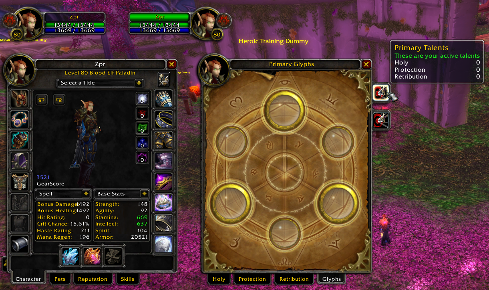

# Paladin Holy

# Disclaimer
Tests were heavily based on DrDamage addon info  
DrDamage Version: [1.7.8](https://www.wowace.com/projects/dr-damage/files/426084) 

Values that have small variations comparing with DrDamage (1-4 diff) are disregard. For example "you hit for 1000" but DrDamage states 1002

Damage attacks/spells were performed agaisnt a lvl60 dummy

# Setup
flat **1492 spellpower** (no talents, buffs, item procs, item tier bonus, glyphs, etc)

# Spells
Spell | status | note
----- | ------ | ----
Blessing of Wisdom          | &nbsp; :heavy_check_mark:
Flash of Light              | &nbsp; :heavy_check_mark:
Cleanse                     | &nbsp; :heavy_check_mark:
Greater Blessing of Wisdom  | &nbsp; :heavy_check_mark:
Concentration Aura          | &nbsp; :heavy_check_mark:
Holy Light                  | &nbsp; :heavy_check_mark:
Consecration                | &nbsp; :heavy_check_mark:
Holy Wrath                  | &nbsp; :heavy_check_mark:
Divine Plea                 | &nbsp; :heavy_check_mark:
Lay on Hands                | &nbsp; :heavy_check_mark:
Exorcism                    | &nbsp; :heavy_check_mark:
Purify                      | &nbsp; :heavy_minus_sign:
Redemption                  | &nbsp; :heavy_minus_sign:
Tirm Evil                   | &nbsp; :heavy_check_mark:
Sacred Shield               | &nbsp; :heavy_check_mark:
Seal of Light               | &nbsp; :warning: | Not proccing from Judgment Attacks. Judgment Damage seems higher. Needs further tests. 
Seal of Righteousness       | &nbsp; :warning: | [Judgment Damage seems higher](./img/spell_judgements.png). Needs further tests.
Seal of Wisdom              | &nbsp; :warning: |  Not proccing from Judgment Attacks. Judgment Damage seems higher. Needs further tests.
Sense Undead                | &nbsp; :heavy_check_mark:

# Talents
Talent | status | note
------ | ------ | ----
Spiritual Focus                 | &nbsp; :heavy_check_mark:
Seal of the Pure                | &nbsp; :heavy_check_mark:
Healing Light                   | &nbsp; :heavy_check_mark:
Divine Intelect                 | &nbsp; :heavy_check_mark:
Unyielding Faith                | &nbsp; :heavy_check_mark:
Aura Mastery                    | &nbsp; :heavy_check_mark:
Illumination                    | &nbsp; :heavy_check_mark:
Improved Lay on Hands           | &nbsp; :heavy_check_mark:
Improved Concentration Aura     | &nbsp; :heavy_check_mark:
Improved Blessing of Wisdom     | &nbsp; :heavy_check_mark:
Blessed Hands                   | &nbsp; :heavy_minus_sign:
Pure of Heart                   | &nbsp; :heavy_check_mark:
Divine Favor                    | &nbsp; :heavy_check_mark:
Sanctified Light                | &nbsp; :heavy_check_mark:
Purifying Power                 | &nbsp; :heavy_check_mark:
Holy Power                      | &nbsp; :heavy_check_mark:
Light's Grace                   | &nbsp; :heavy_check_mark:
Holy Sock                       | &nbsp; :heavy_check_mark:
Blessed Life                    | &nbsp; :heavy_minus_sign:
Sacred Cleansing                | &nbsp; :heavy_check_mark:
Holy Guidance                   | &nbsp; :heavy_check_mark:
Divine Illumination             | &nbsp; :heavy_check_mark:
Judgements of the Pure          | &nbsp; :heavy_check_mark:
Infusion of Light               | &nbsp; :heavy_check_mark:
Enlightened judgments           | &nbsp; :heavy_check_mark:
Beacon of Light                 | &nbsp; :heavy_minus_sign: